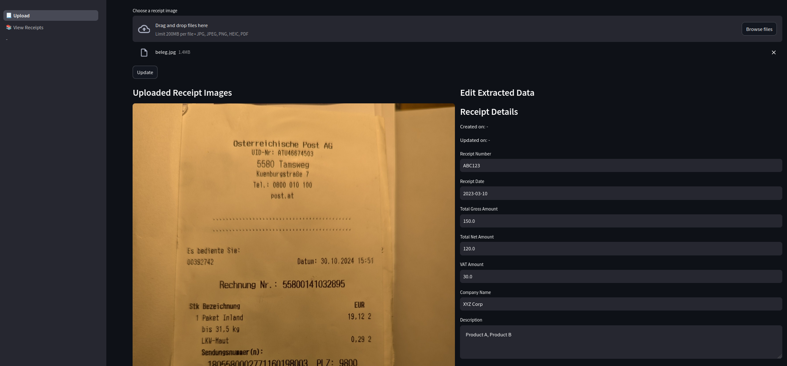
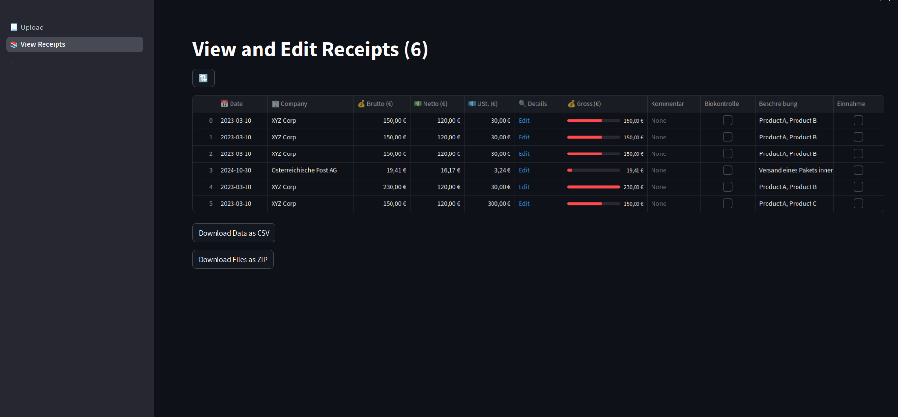

# Receipt Scanner
This is a little Web-App built with [Streamlit](https://streamlit.io/) and queries ChatGPT for scanning receipts and writing them onto a SQLite database.

## Upload
Upload image (e.g. using your Phone and directly take a photo) of a receipt. The image will be sent to OpenAI's API and the text will be extracted using OCR (Optical Character Recognition). The text will then be parsed and stored in a SQLite database.
Click "Extract Data" to start the process.
// Fix embedding as there is no pic

After that you can alter the extracted date, as mistakes can happen.

## Overview
This is an interactive table that shows all the receipts you have uploaded. You can filter and sort and there also is a link to the detail page to edit information or delete the receipt.

### Backup
backup.sh is a simple script that creates a backup of the SQLite database. It is recommended to run this script as a cron-job to keep your data safe. You can also use it to restore the database if needed. I run the the app on my Raspberry Pi and backup to an USB drive. The data only is persisted if there is some change to the date. This avoids redundancy and reduces disk usage.
